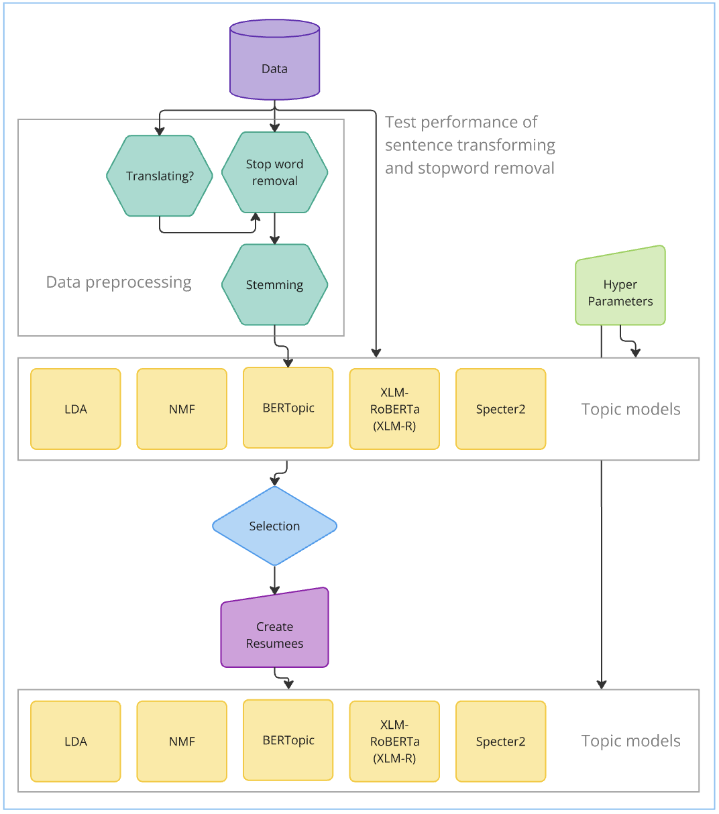

# NLPmodel pipeline

This repository is made to build the pipeline for the NLP models that we would like to test for our bachelor project.

- aForsikringsprojekt

This is the "old" bachelor project before we got the one we are working on now. This could probably be removed.
- data

This is where we store the data that has been preprocessed. This is in order for the preprocessing not having to run at every run of the model.
- modelling

This folder contains all the scripts for the various models that we want to test.
- outputs

This folder contains the outputs from the log, but also outputs from models - graphs, text and so on
- preprocessing

This folder contains the scripts for all the preprocessing of the data.
- raw_data

Contains the raw data recieved from the supervisor. There are no changes to the data at this location.
- main.py

This it the mainscript where all functions are run. Other scripts define functions that are called here.
- parameters.yaml

This is where all the parameters for all code can be found. If something has to be "hard coded" it should be added here, because then we have one central place to change parameters.


# Packages used

- pandas
- yaml
- nltk stopwords
- sentence-transformers
- time
- csv
- random
- asyncio
- googletrans
- umap
- seaborn


# Loading parameters

The code below is what we are using to load our parameters

```python
# load parameters from yaml file.
import yaml
with open('parameters.yaml', 'r') as file:
    parameters = yaml.safe_load(file)
```



